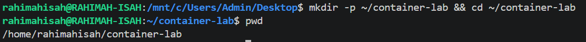
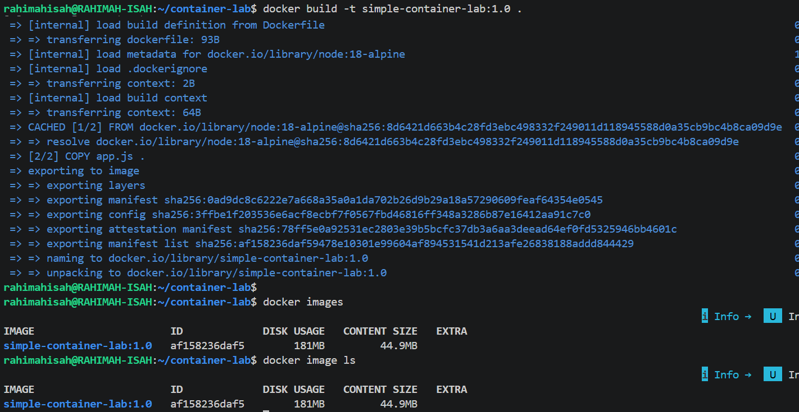

# Simple Container Lab

## 📖 Overview

This project demonstrates the fundamentals of containerization using Docker and version control using Git. A simple Node.js application was created, packaged into a Docker image, executed inside a container, and tracked with Git before being pushed to GitHub.

The lab focuses on understanding the complete workflow—from creating application files and writing a Dockerfile to building an image, running a container, and version-controlling the project.

## 🎯 Objectives

By completing this lab, I was able to:

- Create a simple Node.js application.
- Build a Docker image from a Dockerfile.
- Run the application inside a Docker container.
- Understand the difference between Docker images and containers.
- Initialize and manage a Git repository.
- Connect a local repository to GitHub.

## 🛠️ Technologies Used

- Linux (WSL)
- Docker
- Node.js 18 Alpine
- Git
- GitHub

## 📂 Project Setup

A dedicated project directory was created to organize all files used throughout the lab.

```bash
mkdir -p ~/container-lab && cd ~/container-lab
```

### Explanation

- `mkdir -p` creates the project directory if it does not already exist.
- `cd` navigates into the project directory.

> **Figure 1:** Created the project directory and navigated into it.

<p align="center">
  
</p>

> **💡 Key Learning:** Using a dedicated project directory keeps files organized and makes projects easier to manage.

## 📝 Create the Application

A simple Node.js application was created to serve as the containerized workload.

```bash
touch app.js && echo 'console.log("Hello, DevOps!");' > app.js
```

### Explanation

- `touch` creates the `app.js` file.
- `echo` writes a simple JavaScript statement into the file.
- `>` redirects the output into `app.js`.

> **Figure 2:** Created the Node.js application and verified its contents using `cat app.js`.

<p align="center">
  
</p>

> **💡 Key Learning:** The `>` operator overwrites a file with new content, making it a quick way to create configuration and source files from the terminal.

## 🐳 Create the Dockerfile

A Dockerfile was created to define how the application image should be built and executed.

```bash
touch Dockerfile && echo -e 'FROM node:18-alpine\nCOPY app.js .\nCMD ["node","app.js"]' > Dockerfile
```

### Explanation

- `FROM` specifies the base image.
- `COPY` adds the application file to the image.
- `CMD` defines the default command to run when a container starts.

> **Figure 3:** Created the Dockerfile and verified its contents.

<!-- Insert Screenshot 3 Here -->

> **💡 Key Learning:** A Dockerfile is a blueprint for building a Docker image, ensuring applications can be packaged and run consistently across different environments.

## 🏗️ Build the Docker Image

The Docker image was built from the Dockerfile and tagged with a version for easy identification.

```bash
docker build -t simple-container-lab:1.0 .
```

### Explanation

- `docker build` creates a Docker image.
- `-t` assigns a name and version tag to the image.
- `.` specifies the current directory as the build context.

> **Figure 4:** Successfully built the Docker image.

<!-- Insert Screenshot 4 Here -->

> **💡 Key Learning:** Docker builds images by following the instructions in the Dockerfile, creating a reusable package that can be deployed consistently.

## 🔍 Verify the Docker Image

The newly created image was verified to ensure it was successfully stored in the local Docker image repository.

```bash
docker image ls
```

### Explanation

- `docker image ls` lists all Docker images stored on the local machine.
- This confirms that the image was built successfully and is ready to be used.

> **Figure 5:** Verified that the `simple-container-lab:1.0` image was created successfully.

<!-- Insert Screenshot 5 Here -->

> **💡 Key Learning:** Building an image and verifying its existence are two separate steps. Confirming the image before running it helps ensure the build completed successfully.

## 🚀 Run the Application Container

A container was created from the Docker image and executed to verify that the application ran successfully.

```bash
docker run --rm simple-container-lab:1.0
```

### Explanation

- `docker run` creates and starts a container from the image.
- `--rm` automatically removes the container after it stops, preventing unused containers from accumulating.

> **Figure 6:** Successfully ran the container and displayed the application output.

<!-- Insert Screenshot 6 Here -->

> **💡 Key Learning:** A Docker image is a reusable template, while a container is a running instance of that image.

## 🌿 Initialize Git Version Control

Git was initialized to begin tracking changes made to the project.

```bash
git init
```

### Explanation

- `git init` creates a local Git repository by adding a hidden `.git` directory.
- This enables version control for the project.

> **Figure 7:** Initialized the project as a Git repository.

<!-- Insert Screenshot 7 Here -->

> **💡 Key Learning:** Version control makes it possible to track changes, collaborate with others, and restore previous versions of a project when needed.

## 📦 Stage Project Files

The project files were added to Git's staging area in preparation for the first commit.

```bash
git add .
```

### Explanation

- `git add .` stages all new and modified files in the current directory.
- Staged changes are included in the next commit.

> **Figure 8:** Staged the project files using Git.

<!-- Insert Screenshot 8 Here -->

> **💡 Key Learning:** The staging area allows you to review and control exactly which changes will be included in a commit.

## 📝 Create the Initial Commit

The staged project files were committed to create the first snapshot in the repository's history.

```bash
git commit -m "feat: first container"
```

### Explanation

- `git commit` saves the staged changes to the Git repository.
- `-m` provides a descriptive commit message without opening a text editor.

> **Figure 9:** Created the initial Git commit.

<!-- Insert Screenshot 9 Here -->

> **💡 Key Learning:** Each commit represents a permanent snapshot of the project, making it easy to track progress and revert to previous versions when necessary.

## ☁️ Configure the GitHub Remote

The local Git repository was linked to a remote GitHub repository to enable collaboration and backup.

```bash
GITHUB_USERNAME="rahimahisah17"

git remote add origin https://github.com/${GITHUB_USERNAME}/simple-container-lab.git
```

### Explanation

- A shell variable was created to store the GitHub username.
- `git remote add origin` connects the local repository to its remote GitHub repository.
- `origin` is the conventional name for the primary remote.

> **Figure 10:** Connected the local repository to GitHub.

<!-- Insert Screenshot 10 Here -->

> **💡 Key Learning:** A remote repository enables code sharing, collaboration, and synchronization between your local machine and GitHub.

## 🚀 Publish the Project to GitHub

The local repository was successfully pushed to GitHub, making the project available online and enabling version history to be shared.

```bash
git push -u origin main
```

### Explanation

- `git push` uploads local commits to the remote repository.
- `-u` sets `origin/main` as the default upstream branch, allowing future pushes with `git push`.

> **Figure 11:** Successfully published the project to GitHub.

<!-- Insert Screenshot 11 Here -->

> **💡 Key Learning:** Publishing a project to GitHub provides a remote backup, supports collaboration, and showcases your work to potential employers.

## 🚧 Troubleshooting

During this lab, I encountered and resolved the following issues:

| Issue | Cause | Resolution |
|------|-------|------------|
| Git authentication failed (`Authentication failed`) | VS Code's Git credential helper was unavailable, preventing authentication with GitHub. | Reopened VS Code to refresh the Git credential helper and authenticated again. |
| `non-fast-forward` push rejected | The remote repository already contained a commit created when the repository was initialized with a README. | Pulled the remote changes, merged the histories, and pushed the local commits successfully. |
| Divergent branches | The local and remote repositories had unrelated commit histories. | Performed a merge to reconcile both histories before pushing to GitHub. |

> **💡 Key Learning:** Troubleshooting Git errors is an essential skill. Understanding *why* an error occurs is just as important as knowing the command that resolves it.

## 🎯 Key Takeaways

By completing this lab, I gained hands-on experience in:

- Creating and managing project files using the Linux command line.
- Writing a Dockerfile to containerize a Node.js application.
- Building and running Docker images and containers.
- Understanding the difference between Docker images and containers.
- Tracking project changes with Git using commits and version history.
- Connecting a local Git repository to GitHub.
- Troubleshooting common Git authentication and repository synchronization issues.

This project strengthened my understanding of the foundational tools and workflows used in modern DevOps and Cloud Engineering environments.
